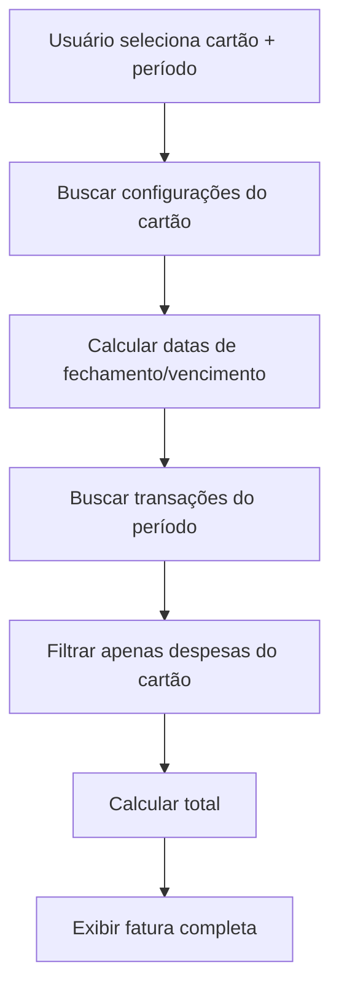

# 🎯 Sistema de Gerenciamento de Faturas de Cartão

## ✅ O que foi implementado

### 1. **Modal de Gerenciamento de Faturas**
- Localização: `/src/components/faturas/GerenciarFaturasModal.tsx`
- **Features:**
  - ✅ Seleção de cartão com dados reais do usuário (nome, banco, limite, cor)
  - ✅ Seleção de mês e ano
  - ✅ Cálculo automático de datas de fechamento e vencimento
  - ✅ Listagem de transações do período
  - ✅ Cálculo do total da fatura
  - ✅ Indicador de fatura vencida
  - ✅ Visualização de parcelas nas transações
  - ✅ Interface moderna com cards e badges

### 2. **Lógica de Cálculo de Períodos**
O sistema calcula corretamente:
- **Data de Fechamento**: Dia configurado no cartão do mês selecionado
- **Data de Vencimento**: Se vencimento ≤ fechamento → mês seguinte, senão → mesmo mês
- **Período da Fatura**: Do fechamento anterior até o fechamento atual

Exemplo:
```
Cartão: Dia fechamento 15, Dia vencimento 10
Fatura de Janeiro/2026:
- Período: 15/12/2025 até 15/01/2026
- Fechamento: 15/01/2026
- Vencimento: 10/02/2026
```

### 3. **Integração com Sistema Existente**
- ✅ Usa dados reais da tabela `accounts` (cartões do usuário)
- ✅ Busca transações da tabela `transacoes`
- ✅ Filtra apenas cartões de crédito (tipo = 'credito')
- ✅ Respeita campos existentes: `dia_fechamento`, `dia_vencimento`, `banco`, `limite`, `cor`

### 4. **Interface Rica**
- 📊 Cards com informações do cartão (banco, limite, fechamento, vencimento)
- 📅 Resumo da fatura (fechamento, vencimento, total)
- 📋 Lista de transações com detalhes (data, categoria, parcelas)
- 🎨 Cores personalizadas por cartão
- ⚠️ Badges de status (vencida, parcelas)

## 📁 Estrutura de Arquivos

```
src/
├── components/
│   └── faturas/
│       └── GerenciarFaturasModal.tsx  ← Novo componente
└── pages/
    └── Transacoes.tsx  ← Modificado (import + integração)
```

## 🔧 Como Usar

### 1. Na interface:
1. Ir em **Transações**
2. Clicar em **📋 Faturas** (menu superior)
3. Clicar em **📋 Gerenciar Faturas**

### 2. No modal:
1. **Selecionar cartão** - Lista mostra todos os cartões de crédito cadastrados
2. **Selecionar mês e ano** - Padrão é mês/ano atual
3. **Visualizar fatura** - Carrega automaticamente as transações
4. **Ações disponíveis:**
   - Ver detalhes de cada transação
   - Ver total da fatura
   - Ver status (vencida ou não)
   - Pagar fatura (botão disponível)

## 🎨 Recursos Visuais

### Cards Informativos:
- **Cartão Selecionado**: Mostra banco, limite, datas (com cor personalizada)
- **Fechamento**: Data de fechamento da fatura
- **Vencimento**: Data de vencimento (vermelho se vencida)
- **Total**: Valor total da fatura (sempre em vermelho para despesas)

### Lista de Transações:
- Nome do estabelecimento
- Data da compra
- Categoria (badge)
- Parcelas (se parcelado)
- Valor (verde para receita, vermelho para despesa)

## 🔄 Fluxo de Dados



## 📊 Dados Utilizados

### Tabela `accounts` (cartões):
- `id` - ID do cartão
- `name` - Nome do cartão
- `banco` - Nome do banco
- `limite` - Limite do cartão
- `dia_fechamento` - Dia de fechamento (1-31)
- `dia_vencimento` - Dia de vencimento (1-31)
- `cor` - Cor do cartão (hex)
- `tipo` - Tipo (filtro: 'credito')

### Tabela `transacoes`:
- `id` - ID da transação
- `quando` - Data da transação
- `estabelecimento` - Nome do estabelecimento
- `valor` - Valor da transação
- `tipo` - Tipo (receita/despesa)
- `categoria` - Categoria
- `account_id` - ID do cartão
- `parcela_atual` - Parcela atual (se parcelado)
- `total_parcelas` - Total de parcelas

## 🚀 Funcionalidades Implementadas

✅ **Visualização de Faturas**
- Selecionar cartão real do usuário
- Selecionar período (mês/ano)
- Ver todas as transações do período
- Ver total da fatura

✅ **Cálculo Automático**
- Respeita dia de fechamento
- Respeita dia de vencimento
- Calcula período correto
- Identifica faturas vencidas

✅ **Interface Profissional**
- Cards informativos
- Cores personalizadas
- Badges de status
- Lista organizada de transações

✅ **Integração Completa**
- Usa dados reais do banco
- Filtra transações por período
- Mostra informações de parcelas
- Exibe categorias

## 📝 Próximas Melhorias (Sugestões)

### 1. Sistema de Pagamento:
- [ ] Criar tabela `faturas_pagas` para histórico
- [ ] Botão "Pagar Fatura" criar transação de pagamento
- [ ] Marcar fatura como paga
- [ ] Histórico de faturas pagas

### 2. Notificações:
- [ ] Alerta de fatura próxima do vencimento
- [ ] Alerta de fatura vencida
- [ ] Lembrete de fechamento

### 3. Relatórios:
- [ ] Gráfico de evolução de gastos
- [ ] Comparação entre meses
- [ ] Top categorias do mês
- [ ] Exportar fatura em PDF

### 4. Funcionalidades Extras:
- [ ] Antecipação de fatura (ver próximo mês)
- [ ] Simulador de parcelas
- [ ] Controle de limite disponível
- [ ] Divisão de fatura por categoria

## 🎯 Benefícios do Sistema

1. **Controle Real**: Usuário vê exatamente suas faturas com dados reais
2. **Período Correto**: Respeita fechamento e vencimento do cartão
3. **Visão Clara**: Interface limpa mostra todas as informações importantes
4. **Integrado**: Usa os dados já existentes no sistema
5. **Profissional**: Visual moderno e funcional

## 📖 Exemplo de Uso

**Cenário**: João tem um cartão Nubank que fecha dia 15 e vence dia 10.

1. João abre **Transações** → **Faturas** → **Gerenciar Faturas**
2. Seleciona **Cartão Nubank**
3. Seleciona **Janeiro 2026**
4. Sistema mostra:
   - Período: 15/12/2025 - 15/01/2026
   - Fechamento: 15/01/2026
   - Vencimento: 10/02/2026
   - Transações: Todas as compras do período
   - Total: R$ 2.543,67
5. João pode ver cada compra detalhadamente
6. Pode clicar em "Pagar Fatura" quando quiser

## 🔐 Segurança

- ✅ Filtra apenas cartões do usuário logado (via `userid`)
- ✅ RLS (Row Level Security) do Supabase protege os dados
- ✅ Sem exposição de dados sensíveis (apenas últimos dígitos se configurado)

---

**Sistema pronto para uso! 🎉**

Agora você tem um gerenciador profissional de faturas de cartão de crédito, totalmente integrado com os dados reais do usuário.
